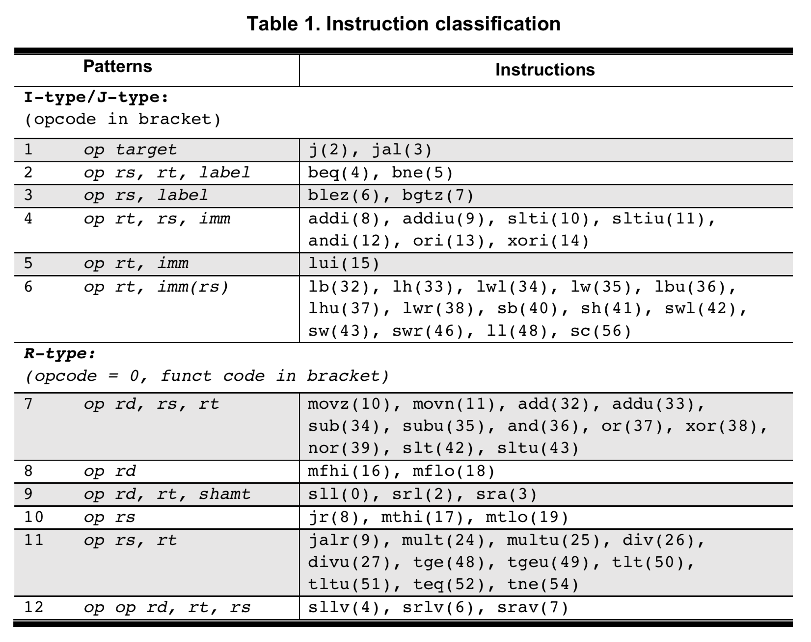
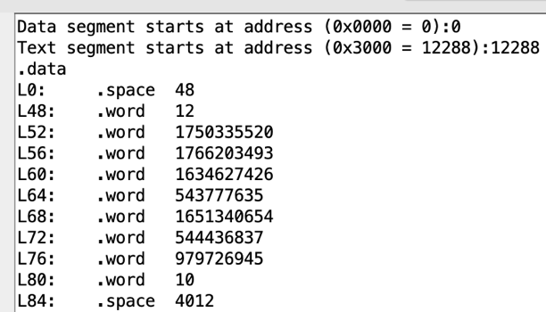
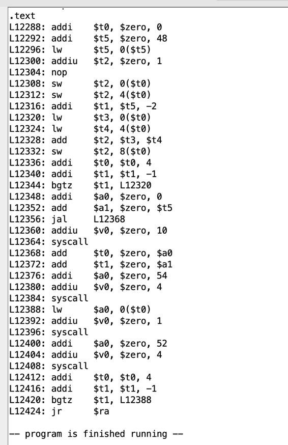
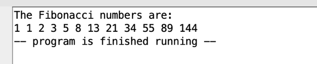

# Build a Disassembler of Machine Code with MIPS R2000

Computer Architecture course project. 

## Objective
Produce syntactically correct disassembly of the machine code with automatically generated labels. The output of the program should be able to reassemble and correctly execute in MARS.

## Environment
[MARS 4.5](http://courses.missouristate.edu/KenVollmar/mars/).

## Supported Instructions
  

## Method Overview
- Labels are generated based on the address of Program Counter and serve as targets for the jump or branch instructions.
- Instructions are parsed based on opcode (31:26), funct(5:0), rs (25:21), rt(20:16), rd(15:11, R-type only), shamt(10:6, R-type only), immediate(15:0, I-type only) or address (25:0, J-type only) fields, and classified into different patterns as shown in the table above.
- Strings are printed based on the offsets that are obtained from the offset arrays.
- Constants and immediates are calculated according to the syntax and formats of the MIPS assembly language.

## Test Case
Test with a Fibonacci program.
### Input
Machine code in [machine_code.asm](./machine_code.asm).
User command line input: base addresses of data and text segments.

### Output
Disassembly of the machine code:  
  
  

Reassemble and execute in MARS produce correct results:  
  